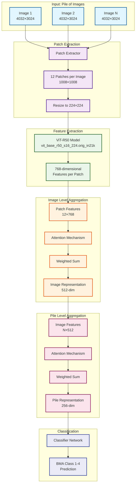
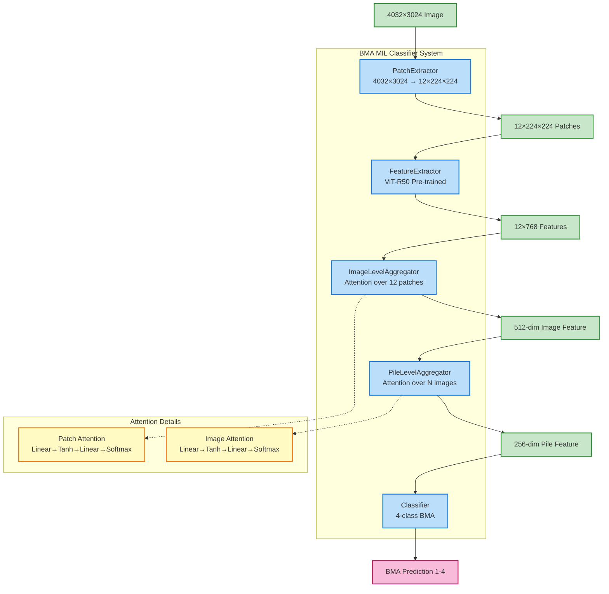
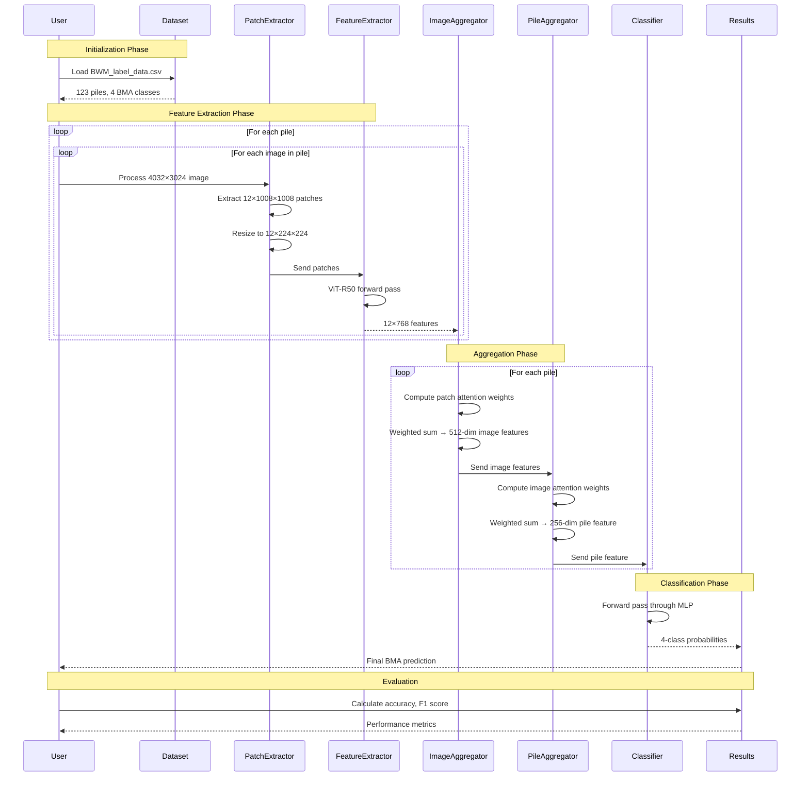
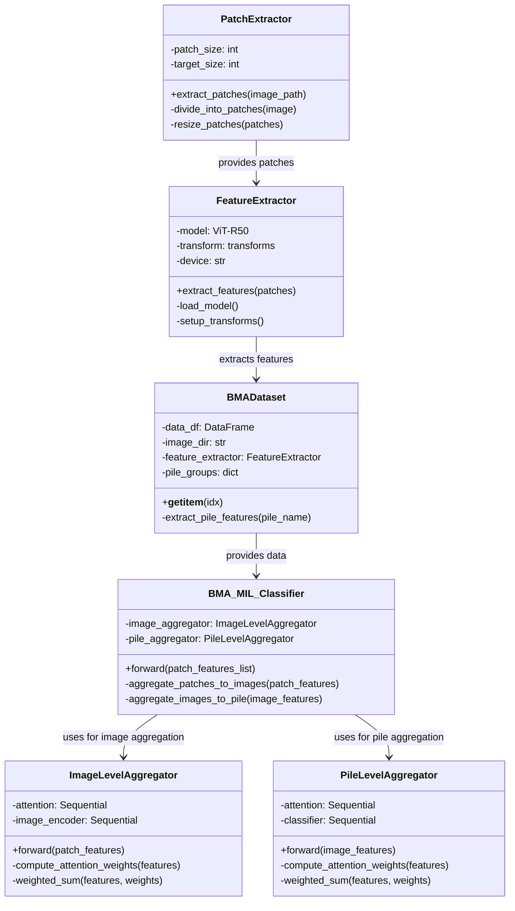

# BMA MIL Classifier - Architecture & Workflow Diagrams

## 1. System Architecture Diagram



## 2. Detailed Component Architecture



## 3. Overall Workflow Diagram



## 4. Data Flow & Dimensions Diagram

```mermaid
graph LR
    %% Input Dimensions
    A[4032×3024×3 Image] --> B[12 Patches]
    B --> C[1008×1008×3 per Patch]
    C --> D[Resize to 224×224×3]
    D --> E[ViT-R50 Input]

    %% Feature Dimensions
    E --> F[768-dim Features<br/>per Patch]
    F --> G[12×768 Features<br/>per Image]
    G --> H[Image Aggregation]
    H --> I[512-dim Image Feature]

    %% Pile Dimensions
    I --> J[N×512 Features<br/>per Pile]
    J --> K[Pile Aggregation]
    K --> L[256-dim Pile Feature]
    L --> M[4-class BMA Prediction]

    %% Styling
    classDef inputDims fill:#e3f2fd,stroke:#1565c0
    classDef patchDims fill:#f3e5f5,stroke:#7b1fa2
    classDef featureDims fill:#e8f5e8,stroke:#2e7d32
    classDef aggregation fill:#fff3e0,stroke:#ef6c00
    classDef outputDims fill:#fce4ec,stroke:#c2185b

    class A,B,C,D inputDims
    class E,F,G patchDims
    class H,I featureDims
    class J,K,L aggregation
    class M outputDims
```



## 5. Training Pipeline Diagram

```mermaid
flowchart TB
    subgraph "Training Pipeline"
        A[Load Dataset<br/>BWM_label_data.csv]
        B[Split Piles<br/>70% Train, 15% Val, 15% Test]
        C[Initialize Model<br/>BMA_MIL_Classifier]
        D[Setup Optimizer<br/>Adam, lr=1e-4]
        E[Training Loop]
        F[Validation]<br/>
        G[Save Best Model]
        H[Test Evaluation]
    end

    subgraph "Training Loop Details"
        E1[For each epoch]
        E2[For each batch of piles]
        E3[Extract patches & features]
        E4[Forward pass through model]
        E5[Compute loss<br/>CrossEntropyLoss]
        E6[Backward pass & update]
    end

    A --> B
    B --> C
    C --> D
    D --> E
    E --> E1
    E1 --> E2
    E2 --> E3
    E3 --> E4
    E4 --> E5
    E5 --> E6
    E6 --> F
    F --> G
    G --> H

    %% Styling
    classDef pipeline fill:#e1f5fe,stroke:#0288d1,stroke-width:2px
    classDef loop fill:#f3e5f5,stroke:#7b1fa2,stroke-width:2px
    classDef eval fill:#e8f5e8,stroke:#388e3c,stroke-width:2px

    class A,B,C,D,E,F,G,H pipeline
    class E1,E2,E3,E4,E5,E6 loop
```

## 6. Model Architecture Details



## Key Features Illustrated:

1. **Multi-level Hierarchy**: Patch → Image → Pile aggregation
2. **Attention Mechanisms**: Both patch-level and image-level attention
3. **Variable Input Support**: Handles different numbers of images per pile
4. **Pre-trained Features**: ViT-R50 for robust feature extraction
5. **End-to-end Pipeline**: Complete workflow from raw images to BMA predictions

These diagrams provide comprehensive visualization of both the architectural design and operational workflow of the BMA MIL classifier system.